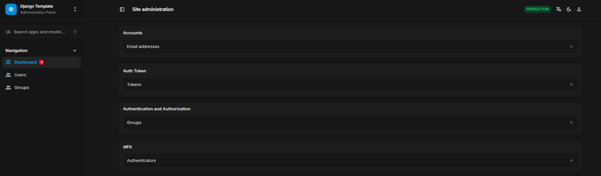

<div align="center">

  <!-- Row of icons -->
  <p>
    
    &nbsp;&nbsp;
    
    &nbsp;&nbsp;
    
  </p>

  <h1>Django Portfolio Template</h1>

  <p>
    A production-ready Django template for personal portfolio websites. It demonstrates a standardised project structure, containerised development environment, automated task runner, and documentation integration. It is designed to showcase projects, experience, and skills with minimal setup.
  </p>

  <p>
    <a href="https://github.com/sean-njela/django_template/graphs/contributors">
    
  </a>
  <a href="">
    
  </a>
  <a href="https://github.com/sean-njela/django_template/network/members">
    
  </a>
  <a href="https://github.com/sean-njela/django_template/stargazers">
    
  </a>
  <a href="https://github.com/sean-njela/django_template/issues/">
    
  </a>
  <a href="https://github.com/sean-njela/django_template/blob/master/LICENSE">
    
  </a>
  </p>
</div>


## Table of Contents

  * [Screenshots](#screenshots)
  * [Tech Stack](#tech-stack)
  * [Prerequisites](#prerequisites)
  * [Quick Start](#quick-start)
  * [Documentation](#documentation)
  * [Features](#features)
  * [Tasks (automation)](#tasks)
  * [Roadmap](#roadmap)
  * [License](#license)
  * [Contributing](#contributing)
  * [Contact](#contact)

<!-- ## Screenshots -->

<!-- <div align="center"> 
  
  
</div> -->

<!-- 
## Demo
<a href="https://www.example.com/">
<div align="center"> 
  
  
</div>
</a>


[](https://www.example.com/)
 -->

<!-- [▶ Watch a short demo](assets/demo-video-small.mp4) -->

## Tech Stack

> List of tools used in the project

[](https://www.jetify.com/devbox/docs/contributor-quickstart/)


[](https://github.com/cookiecutter/cookiecutter-django/)
[](https://github.com/astral-sh/ruff)

## Features

* Modular Django project structure.
* Automated environment setup with Taskfile.
* Integrated documentation with MkDocs.
* Optional GitFlow workflow tasks.
* Preconfigured linting and formatting with Ruff.

## Prerequisites

> This project uses [Devbox](https://www.jetify.com/devbox/) to manage the development environment. Devbox provides a consistent, isolated environment with all the necessary CLI tools pre-installed.

0. **Install Docker**

   - Follow the [installation instructions](https://docs.docker.com/get-docker/) for your operating system.

> The rest of the tools are already installed in the devbox environment

1. **Install Devbox**

   - Follow the [installation instructions](https://www.jetify.com/devbox/docs/installing_devbox/) for your operating system.

2. **Clone the Repository**

   ```bash
   git clone https://github.com/sean-njela/django_template.git
   cd django_template
   ```

3. **Start the Devbox Environment and poetry environment**

   ```bash
   devbox shell # Start the devbox environment (this will also start the poetry environment)
   poetry install # Install dependencies
   poetry env activate # use the output to activate the poetry environment ( ONLY IF DEVBOX DOES NOT ACTIVATE THE ENVIRONMENT)
   ```
> Note - The first time you run `devbox shell`, it will take a few minutes to install the necessary tools. But after that it will be much faster.

## Quick Start

```bash
task setup

task status # check if everything is running

# GIVE EVERYTHING A MINUTE TO SETUP THEN
task dev
```

## Documentation

For full documentation, setup instructions, and architecture details, visit the [docs](mkdocs_docs/index.md) or run:

```bash
# Option 1
task docs

# Or if you prefer the docker version:
# Option 2
task docs-docker

# ONLY RUN ONE OF THE ABOVE
```

Docs are then available at: [http://127.0.0.1:8030/]()

## Tasks

> This project is designed for a simple, one-command setup. All necessary actions are orchestrated through `Taskfile.yml`.

```bash
task setup # setup the environment
task dev # automated local provisioning
task cleanup-dev # cleanup the dev environment
```

### Git Workflow with Git Flow

The `Taskfile.gitflow.yaml` provides a structured Git workflow using Git Flow. This helps in managing features, releases, and hotfixes in a standardized way. To run these tasks just its the same as running any other task. Using gitflow is optional.

```bash
task init                 # Initialize Git Flow with 'main', gh-pages and 'develop'
task sync                 # Sync current branch with latest 'develop' and handle main updates
task release:finish       # Finishes and publishes a release (merges, tags, pushes). e.g task release:finish version="1.2.0"
```

To see all tasks:

```bash
task --list-all
```

If you do not want the gitflow tasks, you can remove the `Taskfile.gitflow.yml` file and unlink it from the `Taskfile.yml` file (remove the `includes` section). If you cannot find the section use CTRL + F to search for `Taskfile.gitflow.yml`.

## NOTES

> Important notes to remember whilst using the project

## Troubleshooting

For comprehensive troubleshooting, refer to the [Troubleshooting](mkdocs_docs/3-troubleshooting/0-overview.md) section. Or open the github pages [here](https://sean-njela.github.io/django_template/3-troubleshooting/0-overview.md) and use the search bar to search your issue (USE INDIVIDUAL KEYWORDS NOT THE ISSUE NAME). 

## Roadmap

* [x] Base project structure
* [ ] Portfolio UI integration
* [ ] Multi-language support
* [ ] Deployment automation

## Contributing

<a href="https://github.com/sean-njela/django_template/graphs/contributors">
  
</a>

> Contributions welcome! Open an issue or submit a PR.

## License

Distributed under the MIT License. See `LICENSE` for more info.

## Contact

Sean Njela – [@linkedin](https://linkedin.com/in/yourlinkedin) – [@twitter/x](https://x.com/devopssean) – [seannjela@outlook.com](mailto:seannjela@outlook.com)

Project Link: [https://github.com/sean-njela/django_template](https://github.com/sean-njela/django_template)

About Me - [About Me](mkdocs_docs/4-about/0-about.md)
